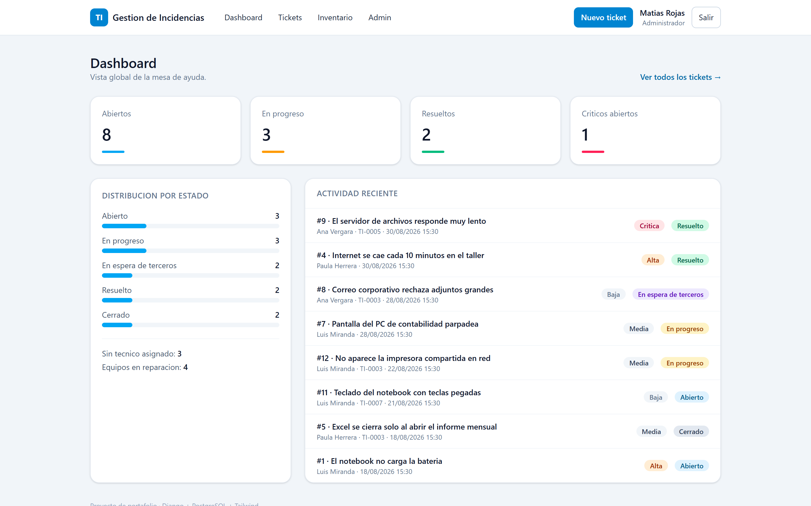
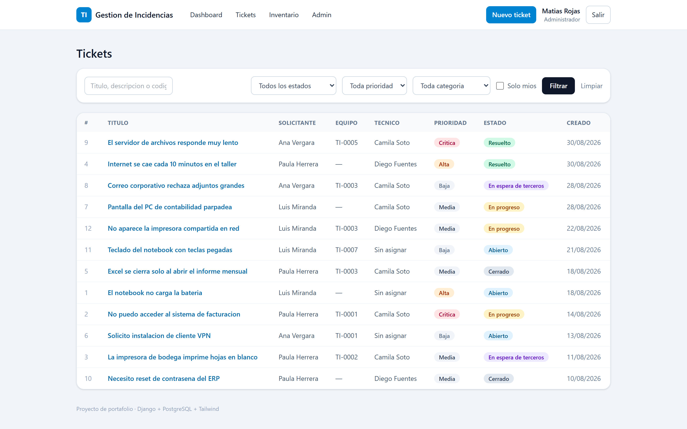
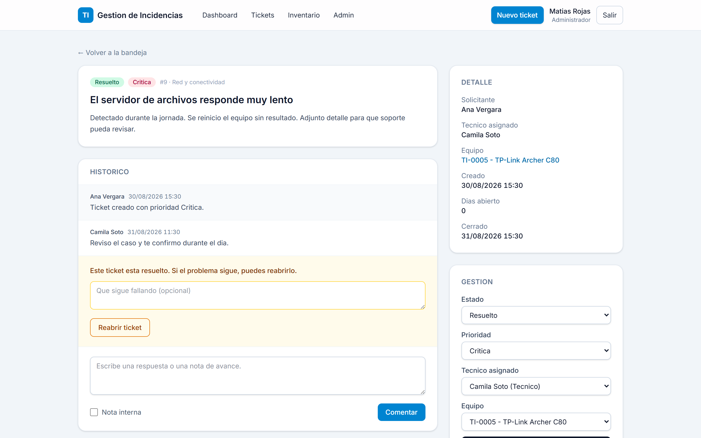
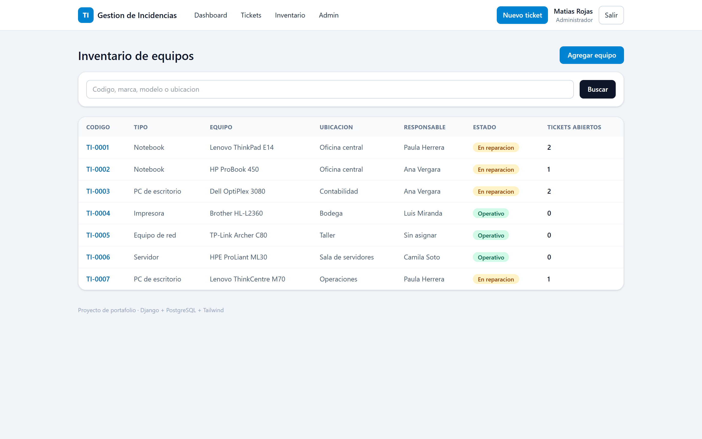
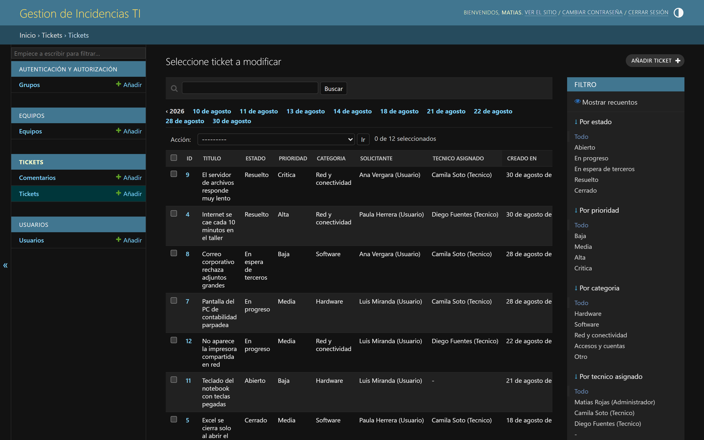
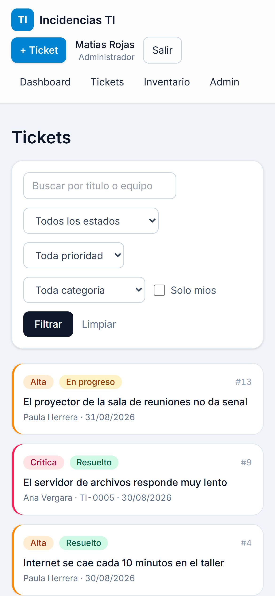
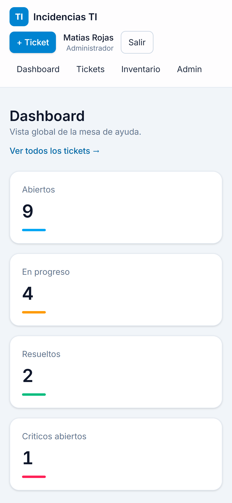
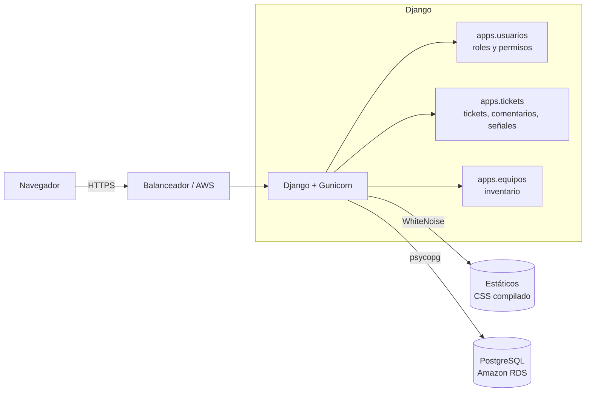

# Gestión de Incidencias TI

[](https://github.com/Matias-dev-cl/gestion-incidencias-ti/actions/workflows/tests.yml)
[](LICENSE)

Sistema de tickets de soporte con inventario de equipos, construido con Django, PostgreSQL y Tailwind CSS.

> **Deploy en vivo:** _pendiente — se publica aquí el enlace de AWS cuando esté arriba._
> Mientras tanto, `python manage.py cargar_demo` deja el sistema con datos reales de ejemplo en un comando.

---

## Qué problema resuelve

En soporte TI las incidencias llegan por WhatsApp, correo y de viva voz en el pasillo. No hay un registro único: se pierde el historial de qué se hizo con cada equipo, nadie sabe qué está pendiente ni quién lo tomó, y la misma falla se diagnostica dos veces porque nadie recuerda la anterior.

Este sistema centraliza eso: cada incidencia queda registrada con su estado, su responsable y su historial completo, **vinculada al equipo físico del inventario** — de modo que abrir un notebook muestra todas las veces que ha fallado.

## Capturas

| Dashboard | Bandeja de tickets |
|---|---|
|  |  |

| Detalle de ticket | Inventario de equipos |
|---|---|
|  |  |

El panel de administración de Django queda configurado con filtros, búsqueda, campos con autocompletado, comentarios en línea y una acción masiva que respeta las señales del dominio:



En pantallas chicas la tabla de tickets se reemplaza por tarjetas en vez de dejar que la fila se desborde en horizontal, porque quien reporta una falla muchas veces lo hace desde el teléfono, parado frente al equipo que no funciona:

<p>
  
  
</p>

## Stack y por qué

| Tecnología | Por qué está aquí |
|---|---|
| **Python** | La lógica de negocio real del sistema —visibilidad por rol, cambios de estado, señales que sincronizan ticket e inventario— vive en Python, no repartida en las plantillas. |
| **Django** | Trae autenticación, permisos, migraciones y panel de administración resueltos. Escribir eso a mano en un proyecto de este tamaño sería trabajo sin retorno. |
| **PostgreSQL** | El modelo es relacional de verdad (usuario → ticket → comentario, ticket ↔ equipo). Las restricciones y los índices se declaran en el modelo y quedan versionados en las migraciones. |
| **Tailwind CSS** | UI responsiva sin arrastrar un framework de JS. El CSS se compila a un archivo estático de ~21 KB; el sistema funciona con JavaScript deshabilitado, incluido el cambio de orden de la cola. |
| **Git** | Historial por rama de funcionalidad, con Conventional Commits. El propio historial muestra en qué orden se construyó. |
| **AWS** | Deploy real con base de datos gestionada, no solo el certificado en el CV. |

## Arquitectura



Tres apps con una responsabilidad cada una. `usuarios` define el modelo de usuario y los mixins de autorización; `tickets` concentra el flujo de trabajo; `equipos` es el inventario. Las señales de `tickets` son el único punto donde una app escribe en la otra, y está aislado en un archivo (`apps/tickets/signals.py`) para que se vea de inmediato.

Detalle del modelo de datos y del flujo de estados: [`docs/arquitectura.md`](docs/arquitectura.md).
Quién puede hacer qué y cómo recorre el sistema una incidencia: [`docs/flujo.md`](docs/flujo.md).

## Roles y permisos

| Acción | Usuario | Técnico | Admin |
|---|:--:|:--:|:--:|
| Crear tickets y comentar | ✅ | ✅ | ✅ |
| Ver **sus** tickets | ✅ | ✅ | ✅ |
| Reabrir un ticket propio ya resuelto | ✅ | ✅ | ✅ |
| Ver **todos** los tickets | — | ✅ | ✅ |
| Notas internas (no visibles al solicitante) | — | ✅ | ✅ |
| Cambiar estado / tomar un ticket | — | ✅ | ✅ |
| Reasignar el ticket a otro técnico | — | — | ✅ |
| Ver **todo** el inventario | — | ✅ | ✅ |
| Ver sus equipos y los compartidos | ✅ | ✅ | ✅ |
| Crear y editar equipos del inventario | — | — | ✅ |
| Panel de administración de Django | — | — | ✅ |

Un usuario común no ve el inventario completo: ve los equipos a su cargo más los que no tienen responsable —impresoras, el router del taller—, que son justamente los que cualquiera necesita poder reportar. El desplegable "equipo afectado" del formulario de ticket respeta el mismo alcance.

## Instalación local

Requiere Python 3.12+ y Node 20+ (Node solo si vas a modificar estilos).

```bash
git clone https://github.com/Matias-dev-cl/gestion-incidencias-ti.git
cd gestion-incidencias-ti

python -m venv .venv
source .venv/bin/activate          # Windows: .venv\Scripts\activate
pip install -r requirements.txt

cp .env.example .env               # Windows: copy .env.example .env
python manage.py migrate
python manage.py cargar_demo       # datos de ejemplo, opcional
python manage.py runserver
```

Abre <http://127.0.0.1:8000>. Si cargaste la demo, las credenciales son:

| Usuario | Clave | Rol |
|---|---|---|
| `admin` | `demo12345` | Administrador |
| `tecnico1` | `demo12345` | Técnico |
| `operaciones` | `demo12345` | Usuario |

**Sin `DATABASE_URL` el proyecto usa SQLite**, para que un clon recién hecho corra sin instalar PostgreSQL. Para usar PostgreSQL en local, descomenta `DATABASE_URL` en el `.env`.

Para recompilar los estilos tras editar plantillas:

```bash
npm install
npm run build:css      # o: npm run watch:css
```

## Tests

```bash
python manage.py test
```

Cubren lo que no es obvio leyendo los modelos: que un usuario no vea tickets ajenos, que resolver un ticket selle la fecha de cierre y que reabrirlo la limpie, y que el estado del equipo en el inventario siga al de sus tickets abiertos.

Cada push y cada pull request los corre en GitHub Actions **contra PostgreSQL**, no contra SQLite: es la base de producción, y las diferencias entre ambas aparecen justamente en lo que este proyecto usa (constraints, índices y agregaciones). El workflow además falla si quedan migraciones sin generar o si `check --deploy` encuentra un error.

## Decisiones técnicas

**1. El rol es un campo del usuario, no un `Group` de Django.**
Aquí el rol es exclusivo —nadie es técnico y usuario a la vez— y se consulta en casi todas las vistas. Un `CharField` indexado se lee de un vistazo y evita un JOIN por request. Los `Group` habrían sido la opción correcta si un usuario pudiera acumular permisos de varias fuentes; no es el caso.

**2. La visibilidad vive en el QuerySet, no en cada vista.**
`Ticket.objects.visibles_para(usuario)` es el único lugar donde se decide quién ve qué. Si esa regla estuviera repetida en cada vista, bastaría una vista nueva escrita con prisa para filtrar datos ajenos. Así el descuido por omisión es imposible: no filtrar significa no tener queryset.

**3. Los efectos de un cambio de estado son señales, no código de la vista.**
Sellar la fecha de cierre, escribir la traza en el histórico y actualizar el estado del equipo deben ocurrir también cuando el cambio viene del admin de Django o de un comando. Puestos en la vista, el admin quedaría escribiendo datos inconsistentes por la puerta de atrás.

**4. El histórico, las notas internas y las entradas del sistema son una sola tabla.**
Es un único hilo cronológico que se lee en orden. Dos banderas booleanas (`es_interno`, `es_sistema`) resuelven el filtrado; tres modelos separados habrían obligado a mezclar y ordenar tres consultas para pintar una sola lista.

**5. El alcance del inventario se resuelve como el de los tickets.**
`Equipo.objects.visibles_para(usuario)` replica el patrón del QuerySet de tickets en vez de inventar un mecanismo distinto. Dos reglas de visibilidad escritas de la misma forma se leen y se auditan de una sola vez; dos formas distintas de hacer lo mismo obligan a revisar ambas cada vez que cambia una.

**6. SQLite como respaldo cuando falta `DATABASE_URL`.**
PostgreSQL es la base objetivo en local y en producción, pero un repo de portafolio que exige levantar Postgres antes de mostrar una pantalla pierde a quien solo quería mirarlo cinco minutos. La configuración es la misma; solo cambia la URL.

## Roadmap — qué falta (v2)

Esto es una v1 funcional y deployada, no un producto terminado. Queda fuera a propósito, y se dice:

- [ ] **Notificaciones** al asignar o resolver un ticket (Django Channels o Firebase). Hoy el solicitante tiene que volver a entrar para enterarse de que le respondieron: es la limitación más visible de la v1.
- [ ] **Adjuntar archivos** a tickets (capturas de pantalla, fotos del equipo) con almacenamiento en S3.
- [ ] **Reportes exportables** a Excel/PDF: carga por técnico, incidencias por equipo, tiempos de cierre.
- [ ] **API REST** con Django REST Framework, para integrarse con otros sistemas internos.
- [ ] **SLA y tiempos de respuesta**: plazo objetivo por prioridad y alerta al vencerlo.

## Deploy en AWS

Notas de la puesta en producción: variables de entorno, RDS, estáticos y checklist previo en [`docs/deploy-aws.md`](docs/deploy-aws.md).

## Licencia

MIT — ver [LICENSE](LICENSE).
