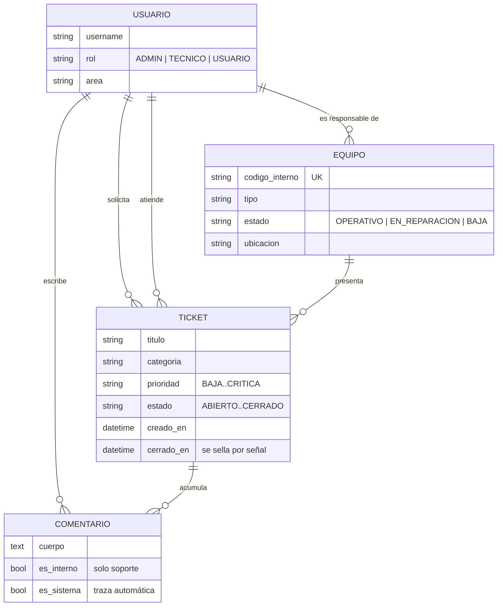
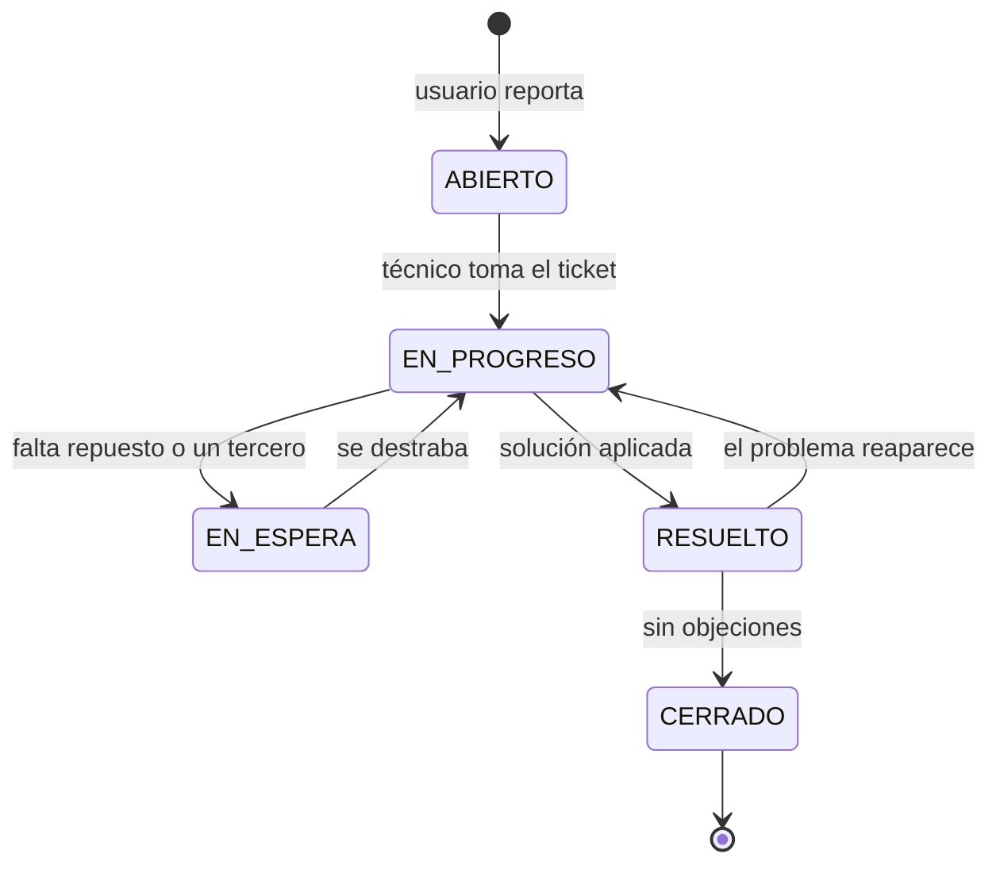

# Arquitectura y modelo de datos

## Modelo de datos



Decisiones de integridad relevantes:

- `Ticket.solicitante` usa `PROTECT`: borrar un usuario no puede dejar tickets huérfanos ni borrar el historial de soporte en cascada.
- `Ticket.tecnico_asignado` y `Ticket.equipo` usan `SET_NULL`: si el técnico se va o el equipo se da de baja, el ticket sigue existiendo, solo pierde esa referencia.
- `Comentario` cae en cascada con su ticket: sin ticket, un comentario no significa nada.
- `limit_choices_to` en `tecnico_asignado` impide asignar un ticket a alguien sin rol de soporte desde cualquier formulario, incluido el admin.

## Flujo de estados



`RESUELTO` y `CERRADO` son los estados finales (`Ticket.ESTADOS_FINALES`). Entrar en uno de ellos sella `cerrado_en`; salir lo limpia. Ambas cosas ocurren en `apps/tickets/signals.py`, así que valen igual desde la interfaz, desde el admin o desde un comando.

## Sincronización ticket ↔ inventario

Es la única escritura de una app sobre la otra, y está concentrada en una señal:

1. Se guarda un ticket asociado a un equipo.
2. La señal consulta si ese equipo tiene tickets abiertos.
3. Si tiene → el equipo pasa a `EN_REPARACION`. Si no tiene → vuelve a `OPERATIVO`.
4. Un equipo dado de `BAJA` se excluye: una baja es una decisión administrativa, no algo que un ticket deba revertir.

Así el inventario nunca miente respecto de lo que la mesa de ayuda está viendo, sin que nadie tenga que acordarse de actualizar dos pantallas.

## Estructura de carpetas

```
gestion-incidencias-ti/
├── config/              # settings, urls, wsgi — configuración por variables de entorno
├── apps/
│   ├── usuarios/        # modelo de usuario, roles, mixins de autorización
│   ├── equipos/         # inventario de activos de TI
│   └── tickets/         # tickets, comentarios, señales, dashboard, comando de demo
├── templates/           # plantillas Django + Tailwind (base, partials, por app)
├── static/src/          # CSS fuente de Tailwind
├── static/css/          # CSS compilado, versionado para que el repo corra sin npm
└── docs/                # arquitectura, deploy y capturas
```
