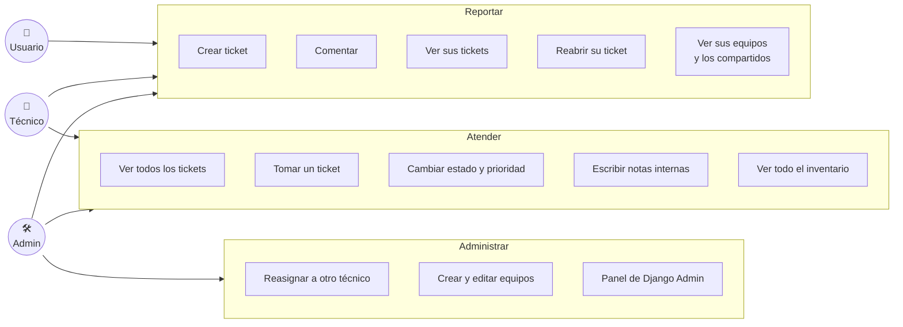
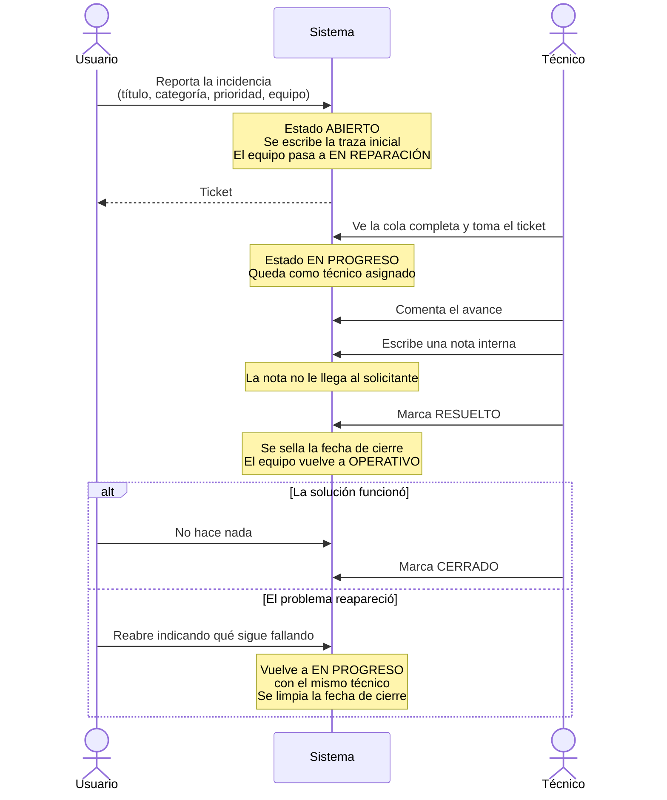
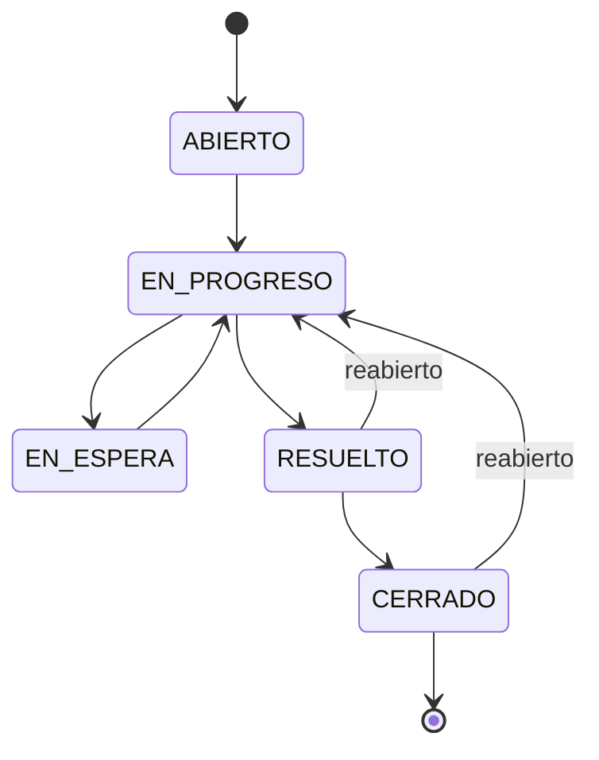

# Alcance y flujo de uso

Este documento responde dos preguntas: **qué puede hacer cada rol** y **cómo recorre el sistema una incidencia**, desde que alguien la reporta hasta que se cierra.

## Quién hace qué

Los permisos son acumulativos hacia arriba: el técnico puede todo lo del usuario más lo suyo, y el admin puede todo. La única excepción es que un técnico **no** reasigna tickets a terceros — se los toma.

## El recorrido de una incidencia

Todo lo marcado como *Note over Sistema* ocurre en `apps/tickets/signals.py`, no en las vistas: pasa igual si el cambio viene de la interfaz, del panel de administración o de un comando.

## Qué ve cada rol al entrar

| Pantalla | Usuario | Técnico / Admin |
|---|---|---|
| Dashboard | Sus propias cifras | Cifras globales, tickets sin asignar y equipos en reparación |
| Tickets | Solo los que él reportó | La cola completa, con filtro "solo míos" |
| Inventario | "Mis equipos": los suyos y los compartidos | "Inventario de equipos": los 7 del ejemplo, con el conteo de incidencias abiertas |
| Detalle de ticket | Histórico sin notas internas | Histórico completo y panel de gestión |

## Los cinco estados

`EN_ESPERA` existe para el caso concreto de la mesa de ayuda: el técnico ya diagnosticó pero depende de un repuesto o de un proveedor. Sin ese estado, esos tickets se ven idénticos a los que nadie ha tocado, y la cola deja de decir la verdad.
